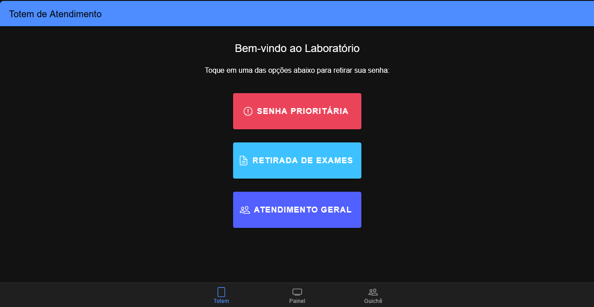
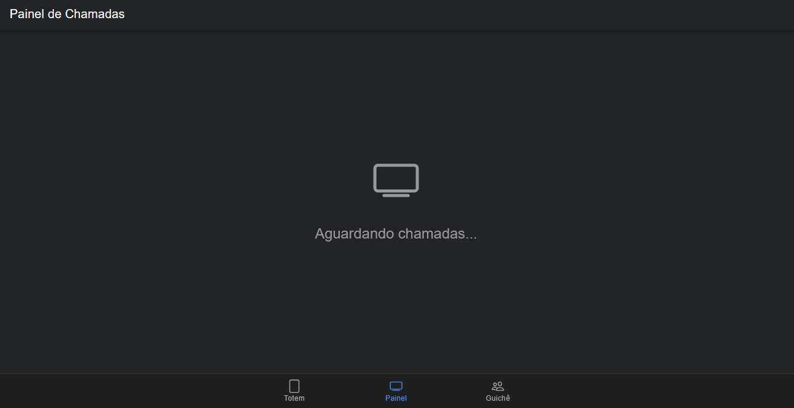
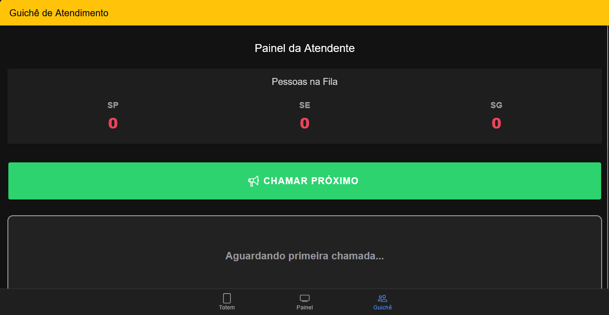

# 🎫 MobileTicketsIonic

Sistema de controle de atendimento para filas de laboratórios médicos, desenvolvido como requisito avaliativo para a disciplina de Desenvolvimento para Dispositivos Móveis.

O aplicativo gerencia a emissão de senhas, a visualização em painel e o controle de chamadas pelo guichê, obedecendo regras matemáticas de prioridade no atendimento.

## 🚀 Tecnologias Utilizadas
* **Framework:** Ionic
* **Linguagem:** TypeScript / HTML / SCSS
* **Estrutura:** Angular (com ngModules)
* **Integração Nativa:** Capacitor

## ⚙️ Regras de Negócio Implementadas
O sistema calcula a prioridade de atendimento seguindo o fluxo `[SP] -> [SE|SG] -> [SP] -> [SE|SG]`:
- **SP (Senha Prioritária):** Alta prioridade de atendimento.
- **SE (Retirada de Exames):** Atendimento rápido (< 1 minuto), chamada intercalada com SP.
- **SG (Senha Geral):** Atendimento normal, chamada após SP e SE.
- Formatação rigorosa de senhas no padrão `YYMMDD-PPSQ`.

## 📸 Telas do Aplicativo

### 1. Totem (Interface do Cliente)
Geração das senhas de acordo com o tipo de serviço.


### 2. Painel (Visão da TV do Laboratório)
Exibição da senha chamada no momento e histórico das últimas 4 chamadas, com layout adaptável.


### 3. Guichê (Interface da Atendente)
Controle da fila em tempo real e acionamento dinâmico da regra de prioridade para a próxima chamada.


## 💻 Como rodar o projeto localmente

1. Clone este repositório:
   ```bash
   git clone [https://github.com/LouiseBraga/MobileTicketsIonic.git](https://github.com/LouiseBraga/MobileTicketsIonic.git)